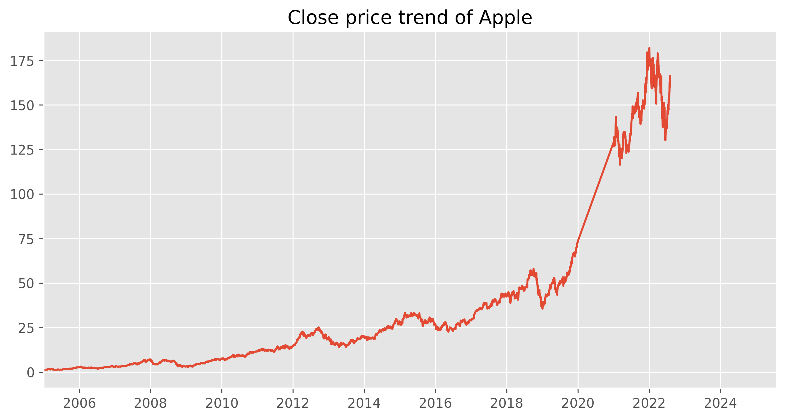

# # :book:Report for the final-project ：

> + Course info ：I&C SCI_X426.85 (SUMMER 2022/REG 00267/SEC 1)
> + Project theme : Thinking about Purchasing Stock  Case Study
> + Group info :
>   + Group 2 : Qi Zhang && Xinmeng Liu

Notice: 

+ Please access to the ipynb file appendix to check the codes.

+ This PDF is only used to explain the operation.

  

## Task 0：Comprehend the features the csv file

 

| Feature        | Explanation                                            |
| -------------- | ------------------------------------------------------ |
| Date           | The recorded date                                      |
| Open           | The price of the stock when the market open            |
| High           | The highest price of the stock today                   |
| Low            | The lowest price of the stock today                    |
| Close          | The price of the stock when the market closed          |
| Adjusted close | The adjusted price of the stock when the market closed |
| Volume         | The number of transactions today                       |

*Notice: When it comes to the history stock analysis, adjusted close price is more useful.*

# Task 1: The choose of data set 

Our group has downloaded 4 stock records from the [Yahoo Finance](https://www.yahoo.com/author/yahoo-finance). 

And we choose to use the stock records of Apple corporation and Microsoft corporation because their amount of data is big enough.

# Task 2: Data Cleasing

1. Import the csv file through `pandas`

   > Notice: The 2020 data is not needed at all due to COVID-19 impacts.

2. Drop the null values of these data sets with null values

   Analysis: **No value is missing in these 2 data sets**

3.  Apply `PCA` analysis or `standarization` if necessary.

   Analysis: Unnecessary to do these operation at present.
   
4. Use the date of the stock record to replace the index. 

# Task 3: Analysis

## 1. Check the trend by close price

​	Here we draw the plots according to the daily stock close price of Apple and Microsoft between 2005-1-1 and 2025-8-1 excluding 2020.

​	We can see that `the close price of these 2 company is increasing in general. ` 

​	The price decrease at the end of 2021 but begin to ascend recently.

​	

## 2. Check the trend by MA of adjusted price

[Moving Average (MA)](https://www.investopedia.com/terms/m/movingaverage.asp):  

+ a moving average is a calculation used to analyze data points by creating a series of averages of different subsets of the full data set

+ By calculating the moving average, the impacts of random, short-term fluctuations on the price of a stock over a specified time frame are `mitigated`.

Here we use the SMA:
$$
SMA \ = \ \frac{A_1 +A_2+A_3+...+A_n}{n} \\\\
\ A=Average \ in \ period 
\\
n=Number \ of \ time \  periods
$$

## 3. Calculate the Rate of Return by Adj Close
[Rate of Return (RoR)](https://www.investopedia.com/terms/r/rateofreturn.asp):

+ The rate of return is the net gain or loss of an investment over a specified time period, expressed as a percentage of the investment’s initial cost.

+ The dividends and effects of inflation are not taken into consideration in the simple rate of return calculation.

The formula to calculate the rate of return (RoR) is:
$$
Rate\ of \ return \ = \ \frac{Initial \ value}{Current \ value−Initial \ value} \times{100} \\\\
$$

We can see that Apple stock dropped almost 20% in 2008, ` and Microsoft's return ratio is more stable than Apple. ` 

## 4. Check the correlation between stocks
The scatter matrix shows that the stock prices of Apple and Microsoft are approximately positively correlated. This is beacuse they are both in technology industry and keep growing.

## 5. Check the Expected Returns and Risk
   We take the mean of returns as their expected returns and the standard deviation of returns as their risk.

   We can see that Apple has more expected return and lower risk than Microsoft.

## The profit

​	Here we assume that the profit only depends on the difference between open price and close price. 
$$
Profit\ Today \ = \ Open \ price \ - \ Close \ price
$$
If the difference today is over 0, we think the stock today is profitable. Else it's not profitable.

+ And the high price, low price and adjusted price is not useful in this part of analysis.

